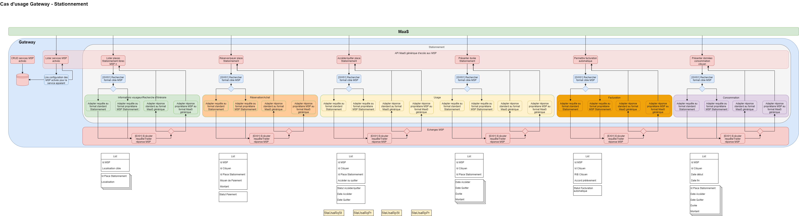
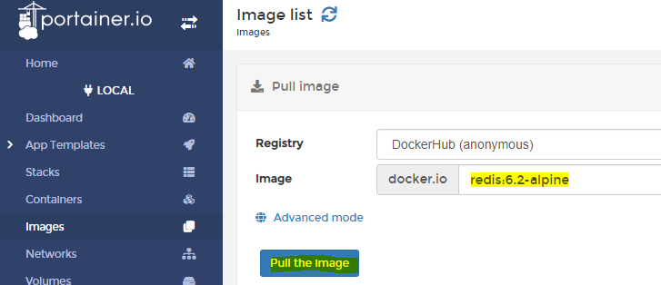
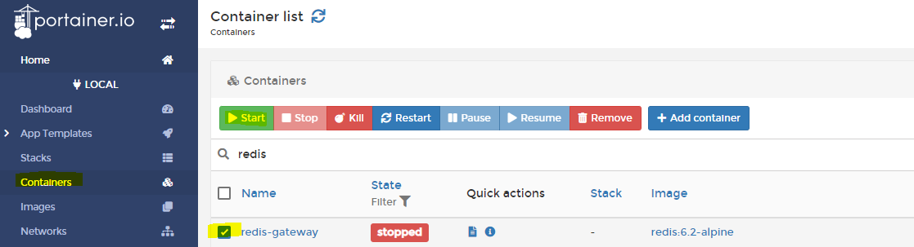

# GATEWAY Standardisation des MaaS





pour générer les classes Java sur la base d'une connexion à la base de données

`mvn antrun:run@hbm2java`


# Lancement de data-api

afin de lancer data-api surchargez le parametre `--DATABASE_PASSWORD=[mon_password]`


# Tests
## Lancement des tests

Au niveau du pom parent lancer install, elle lancera les phases test et verify respectivement pour les TU et TI.

`mvn clean install`

**Dans le fichier maven settings.xml de C:/Users/login/.m2/settings.xml définir les login et mot de passe de la bdd locale.**


```xml
      <test.database.username>postgres</test.database.username>
      <test.database.password>*******</test.database.password>
	
      <gateway.database.username>postgres</gateway.database.username>
      <gateway.database.password>*****</gateway.database.password>
```

Dans les fichiers application.yml, les balises du type @gateway.database.password@ seront remplacés par leurs valeurs du fait de présence dans le pom.xml des élements suivants:

```xml
 <resources>
    <resource>
        <directory>src/main/resources</directory>
        <filtering>true</filtering>
    </resource>
</resources> 
```
et
```xml
<plugin>
    <groupId>org.apache.maven.plugins</groupId>
    <artifactId>maven-resources-plugin</artifactId>
    <version>2.7</version>
    <configuration>
        <delimiters>
            <delimiter>@</delimiter>
        </delimiters>
        <useDefaultDelimiters>false</useDefaultDelimiters>
    </configuration>
</plugin>
```

## Publication des rapports sonar

Afin de récupérer un token sonar, se connecter sous sonar grace au compte gitlab https://sonarqube-dev.cicd.moncomptemobilite.fr/

Aller dans My Account > Security > Generate Token : entrer un nom de token et valider. Une clé sera indiquée à bien conserver car elle ne sera plus affichée.

Placer dans votre settings.xml de maven partie properties

```
    <sonar.host.url>https://sonarqube-dev.cicd.moncomptemobilite.fr</sonar.host.url>
    <sonar.login>__ici__valeur__du__token__</sonar.login>
```
Pour lancer l'analyse et publication des rapports sonar:
`mvn sonar:sonar`

Dans les logs vous sera indiqué l'url de sonarqube avec le résultat de votre rapport.

Exemple de lien de rapport: https://sonarqube-dev.cicd.moncomptemobilite.fr/code?id=com.gateway%3Aparent

# Logs

Afin d'afficher les logs de requête de BDD passer le paramètre suivant au lancement `--SHOW_SQL=[true|false]`


# Exceptions

La gestion des exceptions se fait de manière centralisée dans le module common-api.

L'approche utilisée est l'utilisation du @ControllerAdvice étendant ResponseEntityExceptionHandler.

Toutes les exceptions spring-web sont catchées pour être retranscrites dans le format DTO défini par la gateway et représenté par GenericError du package com.gateway.commonapi.dto.exceptions

S'ils sont spécifiés lorsque les exceptions sont levées, errorCode, label et descriptions sont surchargées sinon c'est la valeur défini dans le fichier error.properties qui est utilisée.

Pour chaque code status http que nous souhaitons implémenté, une classe d'exception existe ainsi que son dto d'erreur.

Lors de la levée d'une de nos exceptions à n'importe quelle couche du code (controller, service, utilitaire, ...) on peut définir le message et la classe d'erreur correspondant. L'exception sera catchée par le module centralisé de gestion des exceptions et contruira la réponse DTO basée sur l'exception reçue.

Le controller devra définir les Schemas utilisées pour les code d'erreur. Cela permet notamment d'avoir une doc swagger avec l'object exact correspondant au code d'erreur qu'on souhaite gérer.

Lors de la réception de l'exception, on vérifie la présence ou non d'un header correlationId servant à identifier la requête à l'origine de la traversée des différents mricoservices dans le but de mieux tracer les logs associés. S'il est présent, ce header est utilisé pour être injecté dans le champ de réponse callId.

Pour cela tout appel à un web service doit se faire avec un RestTemplate et en retransmettant le correlation id s'il existe.
Exemple :
```java
// get the correlationId of the current thread and forward as http header
        UserContext userContext = new ThreadLocalUserSession().get();
                String correlationId = userContext.getContextId();
                HttpHeaders httpHeaders = new HttpHeaders();
                httpHeaders.set(GlobalConstants.CORRELATION_ID_HEADER, correlationId);
                HttpEntity<String> entity = new HttpEntity<>(httpHeaders);
                
            .../...
        try {
            ResponseEntity<MspMetaDTO[]> mspMetasDto = restTemplate.exchange(urlGetMetas, HttpMethod.GET, entity, MspMetaDTO[].class);
            .../...
        } catch (NotFoundException e) {
            log.error("No metadata for MSP identifier {}", mm.getMspId(), e);
        } catch (HttpClientErrorException.NotFound e) {
            log.error(MessageFormat.format("CallId: {0}, {1}", correlationId, e.getMessage()),e);
            throw ExceptionUtils.getMappedGatewayRuntimeException(e, MessageFormat.format(errorsProperties.getTechnicalRestHttpClientError(),urlGetMetas));
        } catch (RestClientException e) {
            log.error(MessageFormat.format("CallId: {0}, {1}", correlationId, e.getMessage()),e);
            throw new BadGatewayException(MessageFormat.format(errorsProperties.getTechnicalRestHttpClientError(),urlGetMetas));
        } catch (Exception e) {
            log.error(MessageFormat.format("CallId: {0}, {1}", correlationId, e.getMessage()),e);
            throw new UnavailableException(MessageFormat.format(errorsProperties.getTechnicalRestHttpClientError(),urlGetMetas));
        }
```

_ExceptionUtils.getMappedGatewayRuntimeException_ est très important, c'est ce qui permet de convertir les exceptions liées à l'appel REST effectué en tant que client à une des exceptions custom et la rendre ainsi "catchable" et donc gérer une réponse retranscrite dans le bon format.

Exemple de levée d'une exception:
```java
throw new BadGatewayException(MessageFormat.format(errorsProperties.getTechnicalRestHttpClientError(),urlGetMeta));
```

errorProperties est un Bean qui sert à accéder aux différents messages qu'on veut paramétrable afin d'en avoir le moins possible en dur dans le code surtout si le message est destiné à l'appelant du service et non uniquement un log.

Lors de la levée de l'exception, on peut passer l'objet global ou uniquement un message (ce qui est le cas ici) qui sera utilisé comme description.

Exemple de levée d'une exception avec un objet complet.

```java
   BadRequest errorBody = new BadRequest();
   errorBody.setErrorCode(Integer.valueOf(this.errorsProperties.getTechnicalMethodNotAllowedCode()));
   errorBody.setDescription(this.errorsProperties.getTechnicalMethodNotAllowedDescription());
   errorBody.setLabel(this.errorsProperties.getTechnicalMethodNotAllowedLabel());
   throw new BadRequestException(errorBody);
```


# Bonnes pratiques

## code

### Variables / Constantes / Fonctions

* Nommer les variables et les fonctions explicitement (éviter le mm, h, abr, toto1, test1, ... ) ainsi que les abréviations. Seul e ou ex est autorisé pour les exceptions catchées.
* Commencer les noms des fonctions et méthodes par un verbe
* Lorsqu'une fonction est privée déclarée dans le contexte d'une classe, utiliser le `.this.nom_de_la_methode()` avant le nom de celle-ci lorsqu'elle est appelée
* Favoriser l'utilisation des méthodes fournies par java comme `.equals, .filter, .stream, ... ` afin de gérer les conditions, ou autre...
* Sortir les string ou chaines de caractères dans des constantes déclarées au niveau de la classe, dans des dictionnaires pour les path d'url, en mettant bien : `private static final String = ".... "` (le nom doit être en majuscule)
  * Lorsque cette chaine est une url et contient des variables, utiliser le nom de la variable défini dans le swagger (ex {mspId}) et utiliser CommonUtils.placeholderFormat afin substituer la variable par sa valeur. 
  * Lorsque cette chaine est un message à destination de l'utilisateur, utiliser un fichier .properties pour stocker les labels et utiliser les variables de substitution {0} {1}, etc... couplé à MessageFormat.format pour la substitution.
* Pas d'instruction de code commenté.
* Les variables, fonctions, messages de logs, commentaires et javadoc en **anglais**. Seuls les messages provenant d'un fichier .properties peuvent être en Français.
* **Checker** vos **MR AVANT** DE DEMANDER A QUELQU'UN DE FAIRE UNE **REVUE** pour faire un premier control. La **pipeline** de test doit être **passante**.
* Vérifier l'**indentation** avec intellij (4 espaces comme motif d'indentation et non la tabulation)


### Exceptions

* Devront être privilégiées l'utilisation des exceptions de `com.gateway.commonapi.exception` en levant ce type d'exceptions sans les catcher puisqu'elle le sront par le @AdviceController.
* Les exceptions hors spring-web (nullPointerExceptions, ParsingExceptions, etc,...) devront être catchées et une des exceptions custom devra être levée dans le catch afin de "remplacer" l'exception et bénéficier du format d'erreur standadisé dans la Gateway.

### Autre 

* Les noms de packages en minuscules sans tirets ou underscore
* Loggers
   * Utiliser les annotations @Slf4j et @Data de lombok pour s'épargner à écrire du code
   * sur un log d'erreur, toujours renseigner l'exception en dernier paramètre du log afin de ne pas masquer la stack stace: exemple `log.error("Error parsing price List",e);`
   * si plusieurs ligne de code ou une boucle déclenche un log, encadrer par une condition `if(log.isDebugEnabled())` ou le niveau de code correspondant afin de ne pas évaluer la condition à chaque log.debug d'une boucle et la bypasser.
   * Utiliser au maximum le niveau debug pour les logs, info avec parcimonie, warn et error que pour des cas d'erreurs ou de risque d'instabillité nécessitant d'être traité. En production les logs debug voire info ne seront pas générés.
   * Ne jamais logger d'information utilisateur, apiKey, mot de passe ou information sensible sans la masquer


### Web services
|Sujet| Convention cible                            |
|:----|:-------------------------------------------------------------------------------------------------------------------------------------------------------------------------------------------------------------------------------------------------------------------------------------------------------------------------------------------------------|
|Langue| Anglais partout préconisé                            |
|Contrôleurs| Le nom du groupe d’opérations doit correspondre au nom de l’objet principal (ex. Citoyens au lieu de CitoyensController)<br/>Un seul groupe par objet métier principal<br/>La version figure dans l’url du endpoint au début (ex. /v1/demandes)                            |                            |
|URLs - Noms > Verbes| Utiliser les noms des objets métiers pour décrire les ressources.  <br/>On peut utiliser un verbe uniquement dans certains cas spécifiques (ex. GET /search sur une collection, POST /search), lorsqu’aucun verbe HTTP ne correspond à l’action réalisée. <br/>Note : La méthode HEAD peut être aussi utiliser pour obtenir un count d’une collection. |
|URLs – Pluriel / Singulier| Pluriel tout le temps                            |
|Casse cohérente - URLs| spinal-case (ex. /global-view, /msp-metas)                            |
|Casse cohérente – Body / Params| lowerCamelCase (fréquemment utilisée par les communautés Javascript, Java…) (ex. employeeId)                            |
|Casse cohérente                | seuls les attributs de base de données et tables de bdd sont en snake_case                            |
| Versionnement                 | Chaque URI doit commencer par un numéro de version sur un digit (ex. /v1 (ou v2, …)  <br/> Ex. /v1/demandes  <br/>On ne change la version qu’en cas de changement majeur, lorsque la rétrocompatibilité est impossible.                            |
| CRUD - verbes HTTP            | Utiliser systématiquement les méthodes HTTP (GET/ DELETE / POST / PATCH / PUT) pour décrire les actions. HEAD pourrait être utilisé le cas échéant.                            |
| Recherche                     | Utiliser /ressource/search?type=value                            |
| Filtres                       | Prévoir des filtres pour chaque GET des grandes collections.                            |
| Pagination                    | La réponse doit être HTTP 206, en fournissant offset / limit /count. <br/>Concerne tous les GET sur des grandes collections.                            |
| Réponses partielles           | Sur les GET des grandes collections, proposer un filtre permettant de choisir les champs à retourner. GET /users/007?fields=firstname,name,street                            |
| Tri                           | Sur les GET des grandes collections, proposer le paramètre sort.   <br/>Ex. ?desc=attribute1,attribute2                            |
| Codes statut HTTP- Succès     | Utiliser les codes retours adaptés.                            |
| Codes statut HTTP- Erreurs    | Spécifier les cas d’erreurs notamment le 400 Bad Request qui permet à l’utilisateur de comprendre pourquoi sa requête n’est pas bonne.  <br/>Les cas d’erreurs fonctionnels identifiés doivent apparaître dans la réponse et des exemples doivent apparaitre dans la doc. <br/>L’erreur 500 Server Error doit toujours être spécifié et retourner un format standard d’erreur.                            |
| Commentaires                  | Chaque URI doit avoir une description.<br/>Chaque URI doit avoir un exemple de réponse visible. <br/>Chaque paramètre doit avoir une description.                            |

### Cache Redis

Prérequis local

- Couper votre redis installé sous windows s'il n'est pas en vers 6.2 ou supérieure. Pour cela aller dans service en tant d'admin, chercher redis et désactiver le service et son lancement auto au redémarrage. 
- Installation de WSL2
- Lancer ubuntu for windows
- Installation de portainer.io en tant qu'image docker sur le ubuntu de WSL
  <pre>docker pull portainer/portainer-ce:2.11.0
  docker run -d --privileged -p 9010:9000 --name portainer --restart=always -v ///mnt/wsl/shared-docker/docker.sock:/var/run/docker.sock -v portainer_data:/data portainer/portainer-ce:2.11.0
  </pre>

- aller sur http://localhost:9010/ avec un navigateur web. Lors de la première connection vous aurez à definir un mot de passe pour admin.
- Charger l'image redis dans portainer et lancer son run

Sous Ubuntu, lancer les commandes : 
docker pull redis:6.2-alpine
docker run -d --name redis-gateway -p 6379:6379 redis:6.2-alpine

Dans portainer.io:

Aller dans Images > Vérifier que l'image existe



Une fois l'image chargée, aller dans Container et vérifier que le container a bien été rajouté



