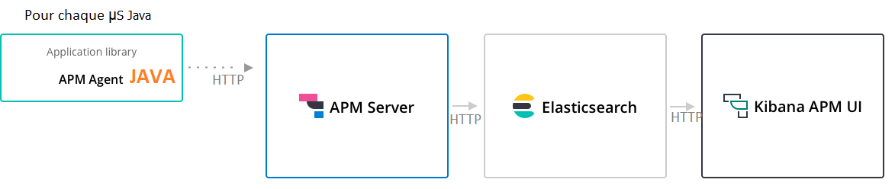
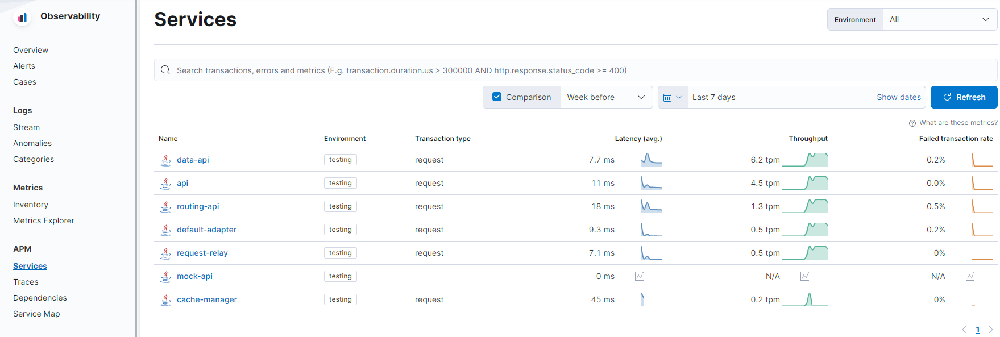
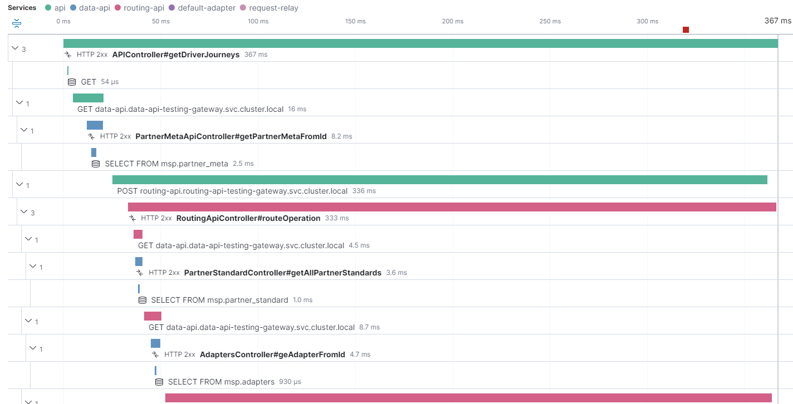

# Application Performance Monitoring

Afin d'obtenir des métriques et détails sur la répartition des temps de réponse à travers les différents microservices un APM a été mis en place.

Il s'agit de l'APM d'elastic qui a été installé dans sa version Legacy https://www.elastic.co/guide/en/apm/guide/7.17/overview.html c'est à dire avec l'installation d'un serveur APM.

L'installation de l'APM serveur a été réalisé au moyen du helm chart officiel apm-server d'elastic https://artifacthub.io/packages/helm/elastic/apm-server/7.17.3




Le principe est que chaque microservice soit lancé avec un javaagent apm-elastic qui se charge de communiquer avec l'APM Server. Les différentes métriques sont donc réceptionnées par l'APM Server qui à son tour indexe les données dans elasticsearch en communiquant avec ce dernier.\
Enfin afin de pouvoir visualiser les données d'APM stockées dans elasticsearch, le composant UI Kibana est installé. Ce dernier contient un module APM afin de visualiser et explorer le détail de transactions.

## Configuration des agents

L'agent java elastic-apm-agent-x.y.z.jar a été placé dans le dossier `delivery/commons/lib` et est copier dans les images dockers de chaque microservice.\
Les microservices invoquent ainsi l'agent avec le paramètre `-javaagent:./elastic-apm-agent-x.y.z.jar`.\
Lors du déploiement des variables d'environnement ELASTIC_* sont définies afin d'indiquer certaines métadonnées pour le microservices ainsi que l'url du serveur agent APM.

```
ELASTIC_APM_APPLICATION_PACKAGES : com.gateway,org.springframework
ELASTIC_APM_ENVIRONMENT : environnement
ELASTIC_APM_SERVER_URL : http://apm-server.elasticsearch-[env]-gateway.svc.cluster.local:8200
ELASTIC_APM_SERVICE_NAME : nom-du-service
```

## Sécurité

L'APM communique avec Elasticsearch au moyen d'un login mot de passe.\
L'accès à l'interface kibana (qui n'est pas exposée via une ingress) nécessite aussi la saisie d'un login/mot de passe.\
En ce qui concerne la communication entre les mciroservices et l'APM ou l'APM et elastic, des networkPolicy ont été mises en oeuvre afin d'autoriser les flux.

## Visualisation

Chaque microservice remonte au niveau de la page d'accueil des services et on peut sélectionner celui qui nous intéresse afin d'explorer le détail des transactions.



On voit ici qu'en sélectionnant le module api qui est le premier des microservices de l'infra, on peut constater la répartition des temps de réponse au travers des différents autres microservices ainsi que les appels externes.  


Ceci est un bon moyen d'analyser et identifier des optimisations possibles dans le temps de traitement de la gateway ou d'identifier les couches responsables de certaines latences éventuelles.
