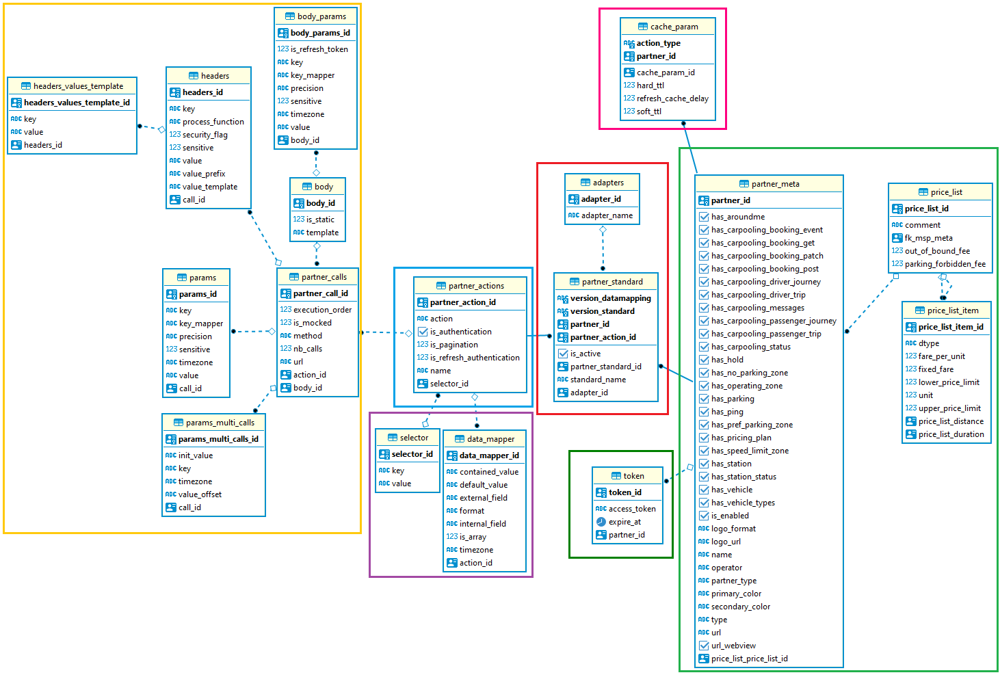

# Documentation technique du dataMapping

## Modèle de données

## Présentation du dataMapping

La persistance en base du DataMapping illustré ci-dessus permet de stocker toutes les informations nécessaires
pour effectuer des requêtes vers des partenaires et les traduire au format de la Gateway.
Les encadrés sur le MCD ci-dessus montrent le découpage réalisé sur les tables. 
Chaque encadré est associé à une étape du processus de transformation requête/réponse et chacun possède son propre CRUD. 

Les informations ou meta-data, données statiques propres aux partenaire, sont réunies dans l'encadré vert et permettent d'identifier les caractéristiques principales
d'un partenaire de la Gateway.

Pour un partenaire en base, nous devons ensuite savoir quelles actions il expose (recherche des véhicules, réservation d'un véhicule ...) et quel standard est suivi pour 
construire les requêtes et réponses associées à chacune. 
Les tables partner-standard et adapters (liste des noms des adapteurs existants), contenues par l'encadré rouge, permettent de faire cette association partenaire/action/adaptateur/versions (du standard et du datamapping).

L'encradré bleu, avec la table partner_actions, décrit une action (SEARCH_VEHICULES, BOOK_VEHICULE, SEARCH_STATIONS ...). Chaque endpoint exposé par api est associé à une action.

A chaque action sont associés le ou les calls à effectuer afin d'obtenir une réponse auprès du partenaire.
L'encadré orange décrit tous les paramètres nécessaires à ces appels http (url, méthode, body, paramètres, headers).

Une fois une réponse obtenue auprès du partenaire, l'encadré mauve avec la table data_mapper, expose la correspondance entre les champs externe (du partenaire) et les champs internes (de la gateway).
Ces informations permettront de convertir la réponse du partenaire au format Gateway.

Enfin l'encadré vert foncé correspond au token du partenaire dans le cas où ce dernier nécessite ce genre d'authentification.

## Description des champs

### Encadré bleu
La table partner-actions permet d'aiguiller la requête en fonction du type d'action

| partner_actions               | Description                                                                             | Exemple                              | Type        |
|:--------------------------|:----------------------------------------------------------------------------------------|--------------------------------------|-------------|
| partner_action_id             | UUID de l'action                                                                        | b814c97e-df56-4651-ac50-11525537964f | UUID        |
| action                    | Nom de l'action en question                                                             | STATION_SEARCH                       | varchar(35) |                            |
| is_authentication         | S'il égal à 1, indique qu'il s'agit d'une action d'authentification                     | 0                                    | integer     |
| is_refresh_authentication | S'il égal à 1, indique qu'il s'agit d'une action de rafraîchissement d'authentification | 1                                    | integer     |
| name                      | Le nom du partner qui invoque l'action                                                      | jcdecaux                             | varchar(25) |
| isPagination              | S'il égal à 1, indique qu'il s'agit d'une action de pagination                          | 0                                    | integer     |

### Encadré mauve

La table selector permet de retrouver le sous-objet attendu par l'action dans la réponse du partenaire

| selector    | Description      | Exemple                              | Type        |
|:------------|:-----------------|--------------------------------------|-------------|
| selector_id | UUID du selector | b814c97e-df56-4651-ac50-11525537964f | UUID        |
| key         | Nom-clé du champ | stations                             | varchar(30) |
| value       | Valeur du champ  |                                      | varchar(50) |

La table data_mapper permet de convertir un champ utilisé par un partenaire en champ utilisé par la gateway.
Elle prend en compte la date et le fuseau horaire en fonction de la position du partenaire

| data_mapper     | Description                                                                                                                     | Exemple                  | Type        |
|:----------------|:--------------------------------------------------------------------------------------------------------------------------------|--------------------------|-------------|
| external_field  | Nom du champ dans la réponse du partenaire                                                                                      | childSeat                | varchar(30) |
| internal_field  | Nom pivot utilisé par la gateway                                                                                                | babySeat                 | varchar(30) |
| contained_value | Si is_array = 1, Nom du champ dans le tableau                                                                                   | babySeat                 | varchar(30) |
| default_value   | Si champ externe est null, sa valeur par défaut                                                                                 | babySeat                 | varchar(30) |
| format          | formule à appliquer sur la valeur du champ reçu   (voir la liste des fonctions dans le tableau des fonctions de formattage) | NUMERIC_OPERATOR(*,1000) | varchar(25) |
| is_array        | S'il égal à 1, indique que la réponse est un tableau                                                                            | 0                        | integer     |
| timezone        | Localisation / Fuseau horaire utilisé par le partenaire                                                                                                                     | Europe/Paris             | varchar(50) |

### Encadré orangé

La table partner-calls permet de décrire les appels associés à une action avec l'ordre d'exécution de chacun

| partner_calls       | Description                                    | Exemple                                  | Type         |
|:----------------|:-----------------------------------------------|------------------------------------------|--------------|
| execution_order | L'ordre dans lequel le call doit-être effectué | 66                                       | integer      |
| is_mocked       | Indique que le call est mocké                  | 1                                        | integer      |
| method          | La méthode de la requête utilisée              | GET                                      | varchar(45)  |
| nb_calls        | Le nombre de call total pour ce call           | 100                                      | integer      |
| url             | L'url du call                                  | https://api.jcdecaux.com/vls/v1/stations | varchar(200) |

La table headers donne les headers à appliquer à un call.
Elle prend en compte la sensibilité des champs censurés.

| headers          | Description                                                                                                                             | Exemple                       | Type         |
|:-----------------|:----------------------------------------------------------------------------------------------------------------------------------------|-------------------------------|--------------|
| key              | Nom du champ                                                                                                                            | Content-type                  | varchar(30)  |
| process_function | Le nom de la fonction a appliquer à la valeur                                                                                           | BASE64                        | varchar(10)  |
| security_flag    |                                                                                                                                         |                               | integer      |
| sensitive        | Le champ en question est sensible (mot de passe, email, etc...).  Si valeur active, il devra être masqué dans les logs applicatifs. | 1                             | integer      |
| value            | Valeur du champ                                                                                                                         | "1977-04-22T01:00:00-05:00"   | varchar(255) |
| value_prefix     | préfix à concaténer à la valeur                                                                                                         | BEARER                        | varchar(10)  |
| value_template   | template clé-valeur                                                                                                                     | "{client_id}:{client_secret}" | varchar(40)  |

| headers_values_template | Description     | Exemple          | Type         |
|:------------------------|:----------------|------------------|--------------|
| key                     | Nom du champ    | Content-type     | varchar(30)  |
| value                   | valeur du champ | application/json | varchar(255) |

La table params permet de trouver les différents paramètres de l'appel (call) http et leurs valeurs

| params     | Description                                                                                                                                        | Exemple      | Type         |
|:-----------|:---------------------------------------------------------------------------------------------------------------------------------------------------|--------------|--------------|
| key        | Nom du champ                                                                                                                                       | key          | varchar(30)  |
| key_mapper | Nom pivot                                                                                                                                          | KEY          | varchar(50)) |
| precision  | Elargie l'heure de la recherche (en minutes)                                                                                                       | 15           | varchar(5    |
| sensitive  | Le champ en question est sensible                                                                                                                  | 0            | integer      |
| timezone   | Localisation/ Fuseau horaire de la requête                                                                                                         | Europe/Paris | varchar(50)  |
| value      | éventuelle valeur par défaut du champ. NB : si value = "null" (en String), cela signifie que le paramètre est facultatif, sinon il est obligatoire | xxxx         | varchar(255) |

Dans le cas d'un appel de type "multi-call" qui nécessite donc plusieurs appels consécutifs, 
la table param_multi_calls donne les clé-valeur des paramètres associés.

| param_multi_calls | Description             | Exemple        | Type        |
|:------------------|:------------------------|----------------|-------------|
| init_value        | Valeur initial          |                | varchar(10) |
| key               | nom du champ            | "date"         | varchar(35) |
| timezone          | Fuseau horaire          | "Europe/Paris" | varchar(50) |
| value_offset      | temps entre chaque call | 30             | varchar(5)  |

Certaines requêtes peuvent contenir un body. La table body donne le template/schéma de celui attendu par le partenaire pour un call donné 
(la table partner_calls est associé à son body via le body_id)

| body      | Description                                                                                                                                                                                               | Exemple                   | Type         |
|:----------|:----------------------------------------------------------------------------------------------------------------------------------------------------------------------------------------------------------|---------------------------|--------------|
| is_static |                                                                                                                                                                                                           |                           | integer      |
| template  | Template attendu par le partenaire. NB : si template = "ORIGINAL_BODY" c'est directement le body original de la requête initial (dans api) qui est passé au partenaire appelé sans traitement particulier | {"bike":"${VEHICULE_ID}"} | varchar(255) |

NB : Si template = ORIGINAL_BODY cela signifie qu'on doit passer tel quel au partenaire le body envoyé par le Maas via Gateway API 

La table body_params permet de récuperer les valeurs 
(soit directement en base soit via leurs clé dans le body de la requête originelle) des différents champs du body.template

| body_params      | Description                                     | Exemple                     | Type         |
|:-----------------|:------------------------------------------------|-----------------------------|--------------|
| is_refresh_token |                                                 | 0                           | integer      |
| key              | Nom du champ dans le body de la requête du Maas | assetId                     | varchar(30)  |
| key_mapper       | Nom pivot                                       | VEHICLE_ID                  | varchar(50)  |
| precision        | Elargie l'heure de la recherche                 | -30                         | varchar(5)   |
| sensitive        | Le champ en question est sensible               | 0                           | integer      |
| timezone         | Localisation de la requête                      | Europe/Paris                | varchar(50)  |
| value            | Valeur du champ                                 | "1977-04-22T01:00:00-05:00" | varchar(255) |

## Fonctions de formattage 

Les fonctions de formattage sont des formules utilisées lors de la transformation de la réponse pour pouvoir convertir la valeur d'un champ de la réponse envoyé par un partenaire (partenaire par exemple) à la valeur attendu par un autre partenaire (MAAS).

Lors de la réception de la réponse, dans la correspondance de transformation de cette réponse/action, le champ Format de la table data_mapper décrit la formule à appliquer sur la valeur du champ reçu.

| Titre de la fonction                             | paramètres possibles                                         | description                                                                                                                                                                                                                                                                                                                                                 | exemples                                                                                                                                                                                                                                                                                                       |
|:-------------------------------------------------|:-------------------------------------------------------------|-------------------------------------------------------------------------------------------------------------------------------------------------------------------------------------------------------------------------------------------------------------------------------------------------------------------------------------------------------------|----------------------------------------------------------------------------------------------------------------------------------------------------------------------------------------------------------------------------------------------------------------------------------------------------------------|
| NUMERIC_OPERATOR (operator, factor)              | operator = * x / + - factor= integer ou float                | Permet de multiplier un nombre par le facteur multiplicateur passé en paramètre                                                                                                                                                                                                                                                                             | Exemple pour passer de km à m     value = 2,    format = NUMERIC_OPERATOR (*,1000)    Résultat= 2000                                                                                                                                                                                               |
| CONVERT_LIST_TO_STRING(caractères-séparateur)    | chaine indiquant les caractères d'espacement post conversion | Converti une liste de String en une String avec les caractères d'espacement indiqués                                                                                                                                                                                                                                                                        | externalField=vehicle.characteristics    internalField=Other    value="["air-conditionnning", "child-seat"]"    format = "CONVERT_LIST_TO_STRING(", ")"     Résultat="air-conditionnning, child-seat"                                                                                            |
| FORMAT_DATE(date-format)                         | pattern de formattage de la date                             | Permet de convertir une date à l'aide d'un format passé en paramètres.  Pour cette opération il faut récupérer la valeur timeZone définie dans la table du datamapper afin de le prendre en compte.   Le date-format correspond au format de date utilisé dans la réponse du partenaire et qui doit être converti au format ISO8601 dans la gateway | Exemple 1: value="2022/05/25 15:55:46"    timeZone=Europe/Paris      format= FORMAT_DATE("yyyy/M/d HH:mm:ss")     Résultat= "2022-05-25T13:55:46.169Z"     Exemple 2 : value=1593878400 timeZone=Europe/Paris    format= FORMAT_DATE("timestamp")     Résultat= "2020-07-04T16:00:00Z" |
| CONVERT_STRING_TO_BOOLEAN()                      | CONVERT_STRING_TO_BOOLEAN(chaine1=boolean1 [,...] )          | Converti des valeurs en leur valeur booléenne "true" présente dans les paramètres.     Une valeur non présente dans le mapping est ignorée                                                                                                                                                                                                              | value="parking_lot"       CONVERT_STRING_TO_BOOLEAN("parking_lot"="stations.isParkingLot","street_parking"="stations.isStreetParking","underground_parking"="stations.isUnderground","sidewalk_parking"="stations.isSidewalkParking")      resultat="stations.isParkingLot:true"                       |

