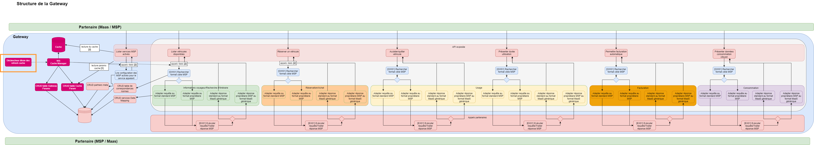

# Documentation technique du module Dkron





## Description

Le module 'déclencheur dkron des refresh cache' (encadré orange ci-dessus) est un service déployé sur la solution dkron et sous les termes de licence LGPLv3 https://dkron.io/license.
Cette solution permet de programmer des tâches cycliques et est utilisée afin de déclencher les appels REST vers le cache manager qui lui même se charge de lancer les requêtes à l'origine de la collecte d'informations auprès des MSP et leur mise en cache dans redis.

Ce microservice est déployé à travers son image docker invoquée dans un template helm chart.
Une interface UI est disponible mais non exposée en externe de la gateway, afin de visualiser les jobs paramétrés les modifier, afficher l'historique des exécutions et les administrer.
Une api est aussi disponible afin de permettre la manipulation des configurations https://dkron.io/api/ et notamment celle des jobs sur /v1/jobs.

Les jobs instanciés dans dkron devront communiquer avec les url internes des différents modules. Dans le cas d'un déploiement sur kubernetes seront donc utilisées les url des services de la forme : service.namespace.svc.cluster.local:port


### Usage

#### Procédure scriptée de backup & restore

Prérequis: installer jq

Backup des jobs
```bash
#!/bin/bash 

# replace with dkron host 
DOMAIN=localhost
# replace with the port of dkron
PORT=8080

# pattern of backup file
DATE=`date +"%Y-%m-%d-T%H-%M"`
BACKUP_FILE=backup-dkron_$DATE

# remove existing file with same name
touch $BACKUP_FILE
rm $BACKUP_FILE

# store json elements representing each job on separate line in a file
curl -X GET  http://$DOMAIN:$PORT/v1/jobs 2>/dev/null | jq -r '.[] | @base64'  | base64 --decode | sed -E "s/\}\{/\}\n\{/g" >> $BACKUP_FILE 
echo "" >> $BACKUP_FILE 
```

Restauration des jobs
```bash
#!/bin/bash 

DATE=`date +"%Y-%m-%d-T%H-%M"`
# replace with file name of the backup
BACKUP_FILE=backup-dkron_$DATE
# replace with dkron host 
DOMAIN=localhost
# replace with the port of dkron
PORT=8080

# iterate over file rows representing each job
while read -r row; 
do
# store json job into new file for curl command
echo "$row" > ligne;
# post the nes job
curl -X POST http://$DOMAIN:$PORT/v1/jobs -d @ligne;
done < $BACKUP_FILE;
# clear the temporaty file created
rm ligne
```
#### Astuces

Dans le cas où le job doit lancer une requête de type post avec un body il faut saisir le body en le stringyfiant.


## Relations avec les autres modules

Le microservice cache-manager est interrogé via des requêtes http par : le composant dkron. \
Il devra contenir les informations nécessaires et suffisantes afin que les requêtes d'alimentation couvrent le scope de ce qui est candidat au cache. La fréquence de paramétrage des sondes devra être en lien avec le soft TTL de la table cache_param et il est conseillé qu'il soit au moins 2 fois inférieur à ce dernier si le hardTtl n'est pas au moins 2 fois plus grand (afin de palier à une perte de donnée en cas d'indisponibilité du MSP lors de l'alimentation).


#### Bilan des relations :
- Dépendance avec "cache manager"
- Dépendance de paramétrage mais pas automatisée avec le module "data-api" et plus précisemment la table cache_param.


## Swagger et port

Dkron tourne sur le port 8080 par défaut. 
L'api est spécifié au format OpenAPI https://dkron.io/redocusaurus/plugin-redoc-0.yaml 