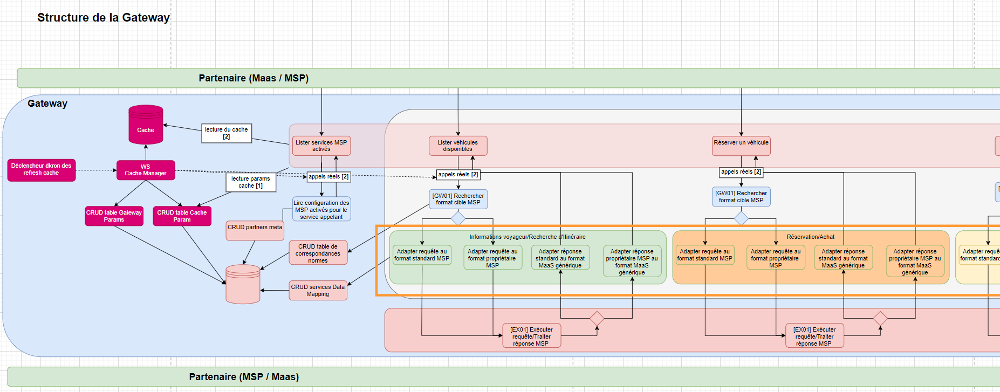
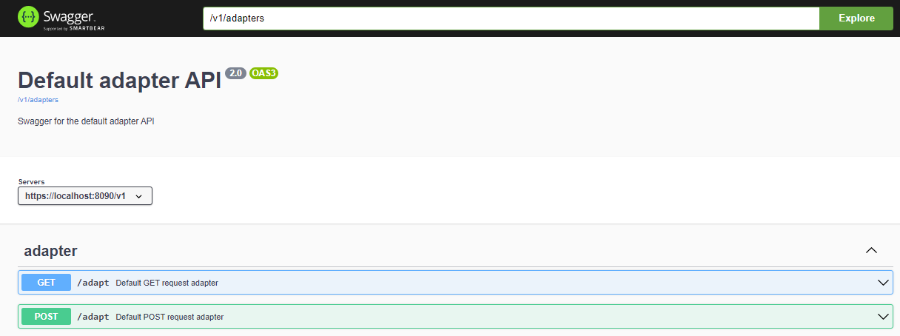

# Documentation technique du module Adapters

## Description
 
Le module adapters (encadré orange ci-dessus) est en charge de la transformation des requêtes de api vers le format attendu par le partenaire interrogé. \
Puis, une fois le partenaire appelé avec la requête adaptée, en charge de la transformation de sa réponse au format exposé par la gateway. \
Le module comporte plusieurs sous modules représentants les différents adaptateurs possibles. Chaque adapter est un microservice. \
La gateway fonctionne actuellement avec un seul adaptateur : "default-adapter" dont l'algorithme de transformation des requêtes et réponses se veut le plus général possible. D'autres adapateurs plus spécifiques à certains partenaires pourront être ajoutés si besoin. \
Le "custom-adaper", non fonctionnel, fait office de mock d'adaptateur.

Le default-adapter expose deux endpoints /adapt:

- GET /adapt permet de passer l'actionId et partnerId des requêtes sans body provenants de api.
- POST /adapt a le même rôle avec la possibilité de passer le body d'origine en plus, pour les requêtes de api qui en possèdent.

## Relations avec les autres modules

Comme représenté sur le schéma "Structure de la Gateway" plus haut, l'adaptateur est appelé par le routing qui lui transmet les éléments associés à la requête initiale : partnerId, actionId, body, paramètres. \
Via des appels REST à data-api, l'adaptateur récupère en base les tables du "data-mapping" (cf. README_DATAMAPPING.md) :
 - le PartnerAction dont l'actionId est donné. Ce PartnerAction représente un service exposé par un partenaire tel que STATION_SEARCH , ASSET_SEARCH , SEND_MESSAGE ... 
 - les PartnerCalls liés à ce PartnerAction (foreign key). Les PartnerCalls et d'autres tables qui lui sont directement associées (body, hearders, params ...) fournissent l'ensemble des paramètres nécessaires à la construction du call pour réaliser l'action souhaitée auprès du partenaire désigné (method http, url, body, parametres, headers etc ...). 

L'adaptateur peut alors construire le call http à requêter auprès du partenaire. Il transmet ces paramètres d'appel au "request-relay" qui exécute l'appel et renvoie la réponse du partenaire telle quelle. 

L'adaptateur effectue ensuite la conversion de cette réponse au format exposé par la Gateway. \
Pour cela, un appel REST vers data-api est réalisé pour récupérer le DataMapper avec l'actionId passé en entrée. Cette table fournie les équivalences entre les "internalField" (nom du champ dans la Gateway) et "externalField" (nom du champ dans la réponse du partenaire) et permet de transformer l'ensemble du json réponse du partenaire en son équivalent au format de la Gateway. \
C'est cette réponse transformée qui est retournée par les endpoints du default-adapter.

#### Bilan des relations :
- Dépendance avec "common-api" : le module common-api fournit des dictionnaires de constantes et divers classes utilitaires
- Requêtes HTTP vers le microservice "data-api" : Récupération du PartnerAction et PartnerCalls associés pour construire la requête au partenaire + Récupération du DataMapper associé pour transformer la réponse
- Requêtes HTTP vers le microservice "request-relay" : Passage des paramètres de l'appel à exécuter auprès du partenaire

## Swagger et port

Le swagger fournit une documentation détaillée des différents endpoints et modèles du module.

Au lancement du microservice default-adapter, le swagger de la class DefaultAdapterController est généré sur le port 8090. \
Url du swagger : http://localhost:8090/v1/swagger-ui/index.html \
Au lancement du microservice custom-adapter, le swagger de la class CustomAdapterController est généré sur le port 8091. \
Url du swagger : http://localhost:8091/v1/swagger-ui/index.html