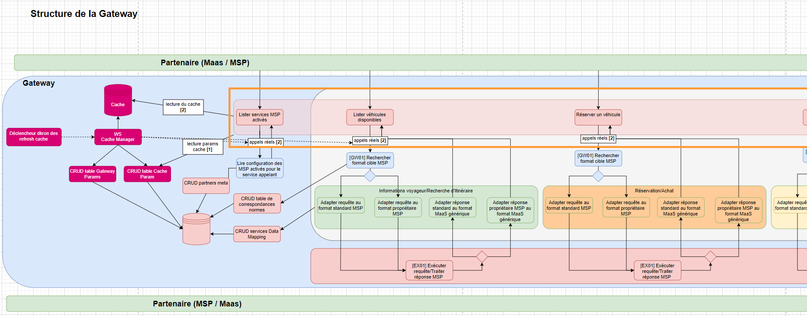
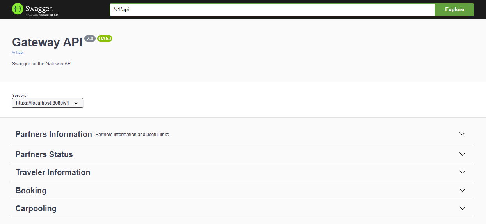

# Documentation technique du module API

## Description
 
Le module api (encadré orange ci-dessus) est le point d'entrée de la Gateway. C'est l'unique microservice exposé aux partenaires (Maas et MSP). \
L'API Gateway met à disposition des partenaires différentes catégories de enpoints taggés :

- "Partners Information" : regroupe des endpoints permettants de connaitre la liste des différents partenaires de la gateway avec leurs informations (meta-data) 
   et les services / enpoints disponibles pour chacun
- "Partners Status" : Requêtes pour vérifier le status d'un partenaire (disponible ou non)
- "Traveler Information" : Endpoints associés à des services d'information voyageur (exemple : GET /partners/{partnerId}/stations pour récupérer la liste des stations d'un MSP )
- "Booking" : Endpoints relatifs à la réservation de véhicules, trajets de covoiturage etc ...
- "Carpooling": Regroupe tous les endpoints du standard Covoiturage

## Relations avec les autres modules

Comme représenté sur le schéma "Structure de la Gateway" plus haut, au niveau de chaque endpoint de api on commence par une vérification des paramètres du cache afin de déterminer si on va lire le cache ou faire un appel réel pour retourner la réponse au partenaire. \
Grâce au CacheService du module common-api : 
  - on vérifie la valeur du singleton CacheStatus (cache disponible ou non) 
  - on vérifie la présence en base d'un CacheParam associé au partnerId donné en entrée pour l'action portée par le endpoint (exemple : le endpoint partners/{partnerId}/stations représente l'action : "STATION_SEARCH") 

Si ces deux conditions sont réunies on récupère les données dans le cache. \
Sinon on procède à un appel réel qui consiste en : 
  - un appel rest vers data-api pour récupérer les PartnerMeta en base, dans le cas des endpoints "Partners Information" 
  - un appel rest vers routing pour transmettre la requête jusqu'à un appel réel au partenaire dont le partnerId est donné en entrée, dans le cas des autres endpoints 
  

#### Bilan des relations :
- Dépendance avec "common-api" : le module common-api fournit des dictionnaires de constantes et divers classes utilitaires
- Requêtes HTTP vers le microservice "data-api" : récupération des PartnerMeta (meta données des partenaires) et CacheParam en base 
- Requêtes HTTP vers le microservice "routing" : redirection de la requête du partenaire (partnerID, action associée, paramètres d'entrée) vers le routing

## Swagger et port

Le swagger fournit une documentation détaillée des différents endpoints et modèles du module.
Au lancement du microservice, le swagger de la class APIController est généré sur le port 8080. \
Url du swagger : http://localhost:8080/v1/swagger-ui/index.html