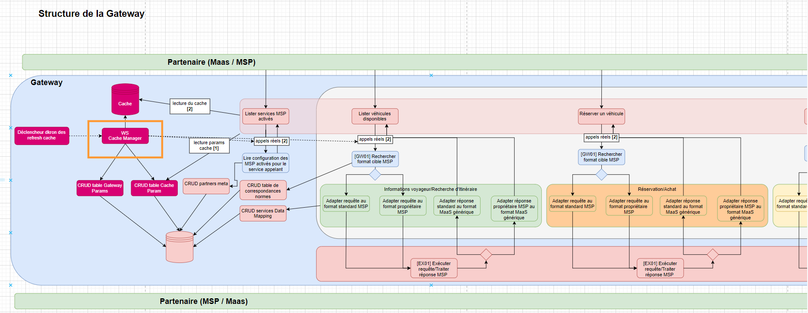
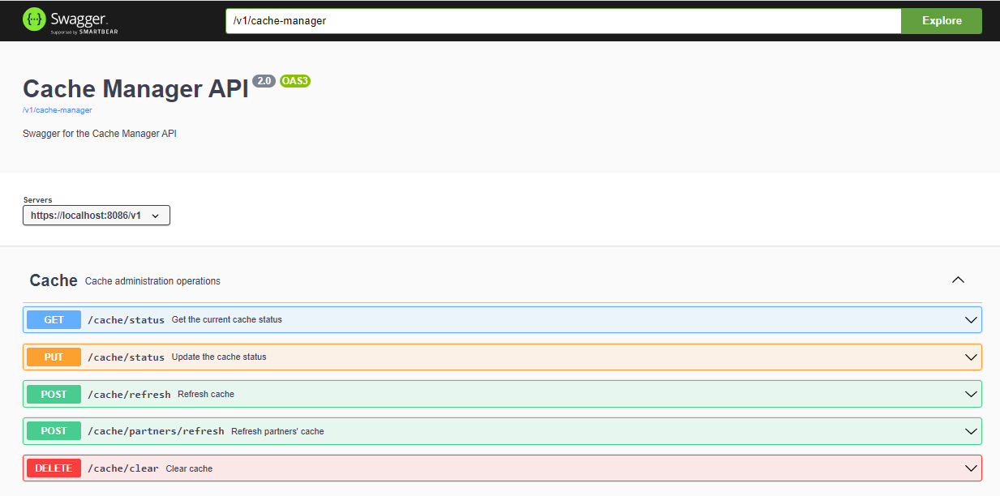

# Documentation technique du module Cache-Manager

## Description
 
Le module cache-manager (encadré orange ci-dessus) est un microservice fournissant les opérations de gestion du cache. Les partenaires externes n'ont pas accès à ces services.

- GET /cache/status : Retourne le singleton CacheStatus dont la valeur du champ enabled indique si le cache est sollicité ou non lors des requêtes de consultation. Le cache reste un composant nécessaire, cette valeur indique cependant si les données peuvent être exposées aux utilisateurs ou non.
- PUT /cache/status : Modifie le status du cache. Il prend en paramètre le booléen isEnabled. Cette valeur est affectée à la donnée CACHE_ACTIVATION en base et à l'instance du singleton CacheStatus (dans common-api).
- POST /cache/refresh : Rafraîchit des données spécifiques en cache. Il prend en paramètre un partnerId et actionName. Le service exécute alors l'appel réel au partenaire pour cette action et met en cache la réponse (après avoir supprimé les anciennes données correspondantes). Lors de la mise en cache, le hard_ttl du CacheParam associé est attribué à la donnée. Un body facultatif permet également de passer une liste de positions (longitude, latitude, radius) lorsqu'elle est indispensable auprès du partenaire pour fournir une réponse exhaustive.
- POST /cache/partners/refresh : Rafraîchit les meta-data en cache de l'ensemble des partenaires. Le service exécute un appel GET /partner-metas à data-api afin de récupérer l'ensemble des PartnerMeta en base et met en cache la réponse (après avoir supprimé les anciennes meta-data).
- DELETE /cache/clear : Vide le cache. Il permet de vider l'ensemble du cache ou seulement les données liées à une liste de partnerId passée en entrée.

## Relations avec les autres modules

Comme représenté sur le schéma "Structure de la Gateway" plus haut, le service dkron effectue des appels cronés aux opérations de refresh du cache-manager afin de mettre le cache à jour à des intervalles de temps prédéfinis (refresh_cache_delay). \
De plus, à chaque opération POST, PUT, PATCH , DELETE sur la table PartnerMeta au niveau de data-api, un appel au POST /cache/partners/refresh du cache-manager est déclenché afin de répercuter ces modifications dans le cache. \
Le service cache/refresh effectue également des GET /cache-params auprès de data-api afin de récupérer les hard_ttl des données. Il s'agit de la durée de péremption de l'élément en cache (sera automatiquement supprimé par Redis).
  

#### Bilan des relations :
- Dépendance avec "common-api" : le module common-api fournit des dictionnaires de constantes et divers classes utilitaires
- Requêtes HTTP vers le microservice "data-api" : pour la mise à jour du CACHE_ACTIVATION en base, récupération des CacheParam et récupération des PartnerMeta.

## Swagger et port

Le swagger fournit une documentation détaillée des différents endpoints et modèles du module.
Au lancement du microservice, le swagger de la class CacheManagerController est généré sur le port 8086. \
Url du swagger : http://localhost:8086/v1/swagger-ui/index.html