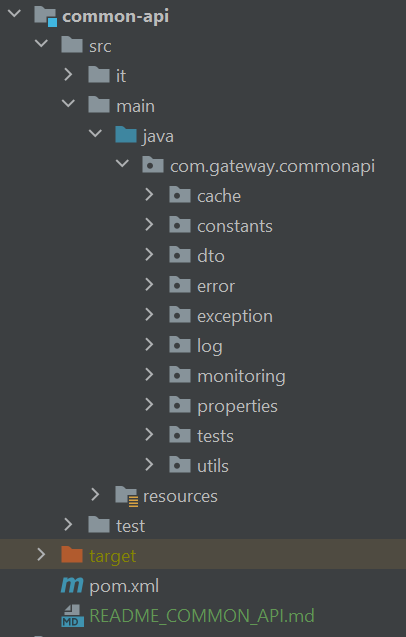

# Documentation technique du module Common-Api

## Description

Le module common-api fait office de librairie commune à tous les autres modules. Il centralise des dictionnaires de constantes et méthodes communes et réutilisables. \
Common-api contient différentes catégories d'utilitaires réparties en packages :

- cache : contient les CacheManager des différentes actions (StationCacheManager, PartnerMetaCacheManager ...). Ces classes fournissent les méthode de remplissage (populateCache) , récupération (getFromCache) et vidage (clearCache) du cache.
- constants : contient divers dictionnaires de messages, urls et autres constantes globales.
- dto : contient les DTO des modèles de api , data et request-relay; ainsi que les DTO des différentes classes d'erreur.
- error / exception : contiennent les modèles et mécanismes de gestion des différentes exceptions. La classe exception > handler > RestResponseEntityExceptionHandler.java notamment constitue le coeur de la gestion et construction des exceptions retournées en fonction du type d'erreur, du standard suivi etc ...
- monitoring : contient des classes de gestion du UserContext
- utils : contient des classes de méthodes utilitaires (CommonUtils, CallUtils ...) ainsi que les enums du projet.

## Relations avec les autres modules

Les autres modules comportent une dépendance à common-api et ce dernier, qui est une librairie, ne dépend d'aucun autre.

