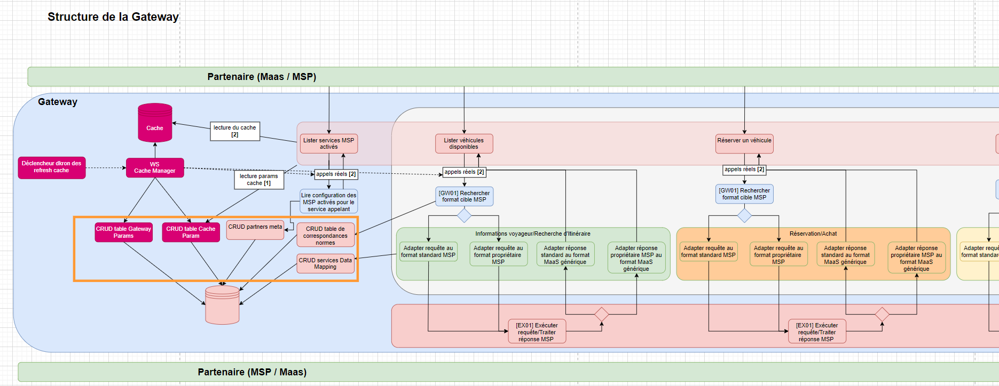
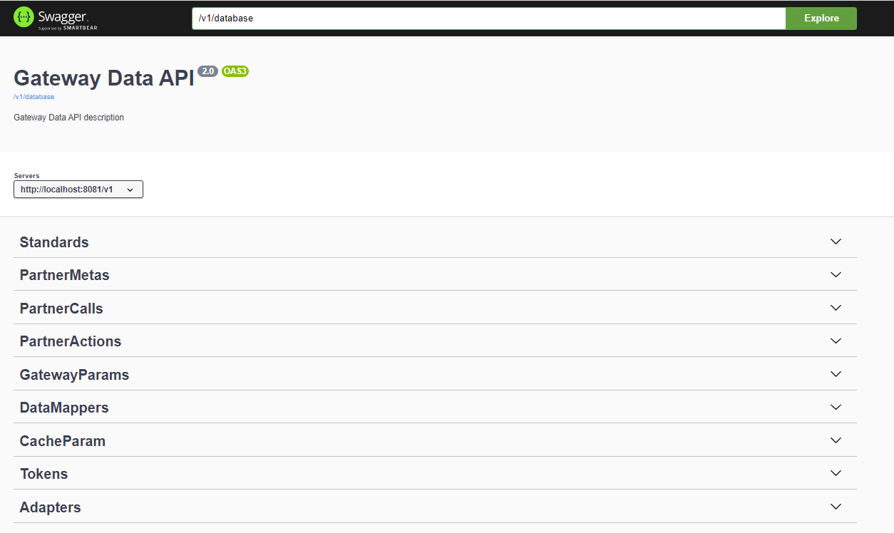

# Documentation technique du module Data-Api

## Description
 
Le module data-api (encadré orange ci-dessus) est un microservice d'administration des données de la Gateway. En effet il fournit les endpoints des opérations de CRUD (GET, POST, PUT, PATCH, DELETE) de l'ensemble des tables de la database. \
Seul un admin de la Gateway a accès à cette Data-Api, elle n'est pas exposée à l'extérieur.
Via les différentes opérations de CRUD, ce microservice permet d'enregistrer en base et éditer les informations de meta-data, data-mapping et configuration des différents partenaires. \
(cf. README_DATAMAPPING à la racine du projet + README_DATA_BASE du module database)

## Relations avec les autres modules

Le microservice Data-Api est interrogé via des requêtes http par : le module api (pour la récupération des meta-data des partenaires et paramètres du cache), le module cache-manager (pour la lecture ou l'update du CACHE_ACTIVATION en base), le module routing (lecture des partner_standard en base pour l'aiguillage des requêtes) et le module adapters (lecture des tables du data-mapping pour la transformation des requêtes et réponses). \
Il appelle les services des différentes tables en base grâce à sa dépendance au module database.
  

#### Bilan des relations :
- Dépendance avec "common-api" : le module common-api fournit des dictionnaires de constantes et divers classes utilitaires
- Dépendance avec "database" : pour accéder aux méthodes des différents services des tables.

## Swagger et port

Le swagger fournit une documentation détaillée des différents endpoints et modèles du module.
Au lancement du microservice, le swagger de l'ensemble des Controller du dossier "rest" est généré sur le port 8081. \
Url du swagger : http://localhost:8081/v1/swagger-ui/index.html