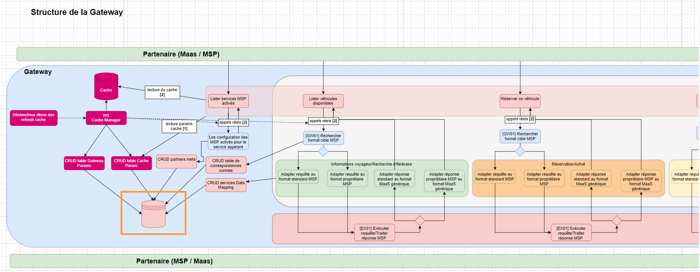
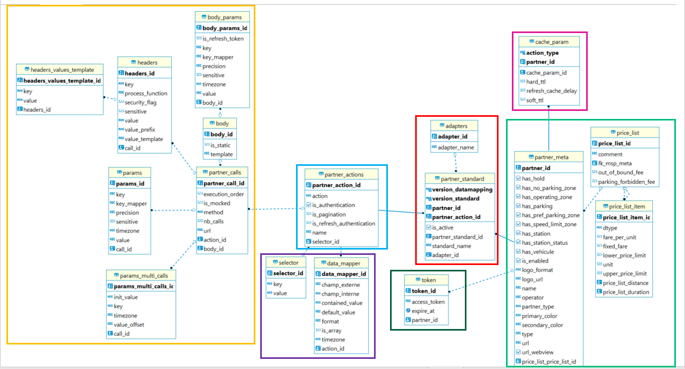
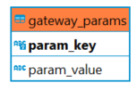

# Documentation technique du module DataBase

## Description
 
Le module database (encadré orange ci-dessus) est le module de configuration de la base de données de la Gateway. \
Il contient les classes de models, repository et services associés aux tables en base. Ce n'est pas un microservice rest.
La base de donnée "gateway" est divisée en deux schémas :
 - #### Le schéma "msp" : 
   Il comporte les tables stockants les informations sur les partenaires (encadré vert clair ci-dessous), leurs normes (encadré rouge), le détail de leurs actions (encadré bleu), les paramètres pour construire les appels (encadrés jaune et vert foncé) et enfin les équivalences pour convertir la réponse à une action (encadré violet). \
   L'ensemble de ces tables constitue le "data-mapping" (cf. README_DATAMAPPING.md à la racine du projet). \
    \
   Ce schéma contient également une table cache_param (encadré rose). Cette table permet de stocker les informations de paramétrage en cache des données d'une action (champ action_type) pour un partner donné (clé étrangère partner_id) : 
     - hard_ttl =  durée de péremption de l'élément en cache (sera automatiquement supprimé par Redis).
     - soft_ttl =  durée de validité de l'élément en cache en secondes. En dessous de soft_ttl la donnée est de bonne qualité. Entre soft_ttl et hard_ttl elle est consommable mais dégradée.
     - refresh_cache_delay = durée en secondes indiquant le délai souhaité avant de rafraichir le cache (valeur à utiliser dans l'outil dkron pour le refresh en cache).
   
   Si pour un partner_action en base, aucun cache_param lié au même partnerId avec partner_action.action = cache_param.action_type n'existe, alors les données de l'action en question sont considérées comme non cachables.
 
 

     

 - #### Le schéma "configuration" : 
   Il contient la table de paramétrage global "GATEWAY_PARAMS" avec en clé primaire le nom du paramètre (varchar(50)) et en valeur une chaine varchar(255). Elle permet de stocker des valeurs pour la configuration générale de la Gateway. \
   L'insertion d'une clé "CACHE_ACTIVATION" avec les valeurs 'true' ou 'false' sous forme de chaine de caractères permet d'activer ou désactiver globalement l'utilisation du cache pour les requêtes du module api.

   

## Relations avec les autres modules

Comme représenté sur le schéma "Structure de la Gateway" plus haut, le module database est exclusivement réservé à la configuration du modèle de données en base. Il est uniquement appelé par le module data-api qui effectue des opérations CRUD sur cette donnée.

#### Bilan des relations :
- Dépendance avec "common-api" : le module common-api fournit des dictionnaires de constantes et divers classes utilitaires

## Elements de configuration

 - Base de données postgresql
 - nom de la base de données : "gateway"
 - noms des schémas : "msp" et "configuration"