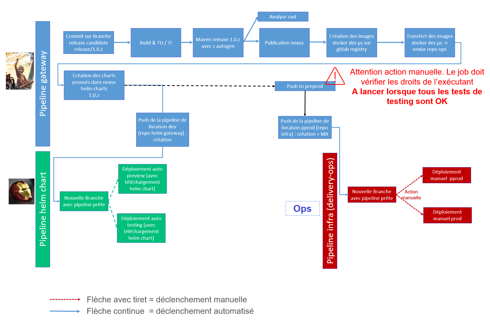

# Documentation du Delivery

## Description

Le dossier delivery contient les fichiers de configuration du déploiement du cluster kubernetes. Il permet de déclarer les règles de sécurité, variables d'environements, stack complète des services à déployer.
Il gère quatre pipelines :
* une de build, gestion des releases déploiement, packaging des helm charts, construction des images docker et mise à dispo sous nexus, et gestion des deux autres pipelines de livraison des composants avec déploiement helm chart qu'elle créé sur deux autres repos.
* une pipeline de publication du code source sur un github. Elle se lance sur un tag et avec le paramètre de pipeline "PUBLISH_CODE" à "true"
* une pipeline de déploiement des environnements preview et testing par publication sur un repo tiers
* une pipeline de déploiement des environnements preprod et production par publication sur un repo tiers

### Variables de CI/CD par repo

- variables du répo de build et contenant la pipeline principale

| Nom Variable                                       | Description                                                                                     |
|----------------------------------------------------|-------------------------------------------------------------------------------------------------|
| SONAR_URL                                          | Url de sonar                                                                                    |
| SONAR_TOKEN                                        | Token pour communiquer avec sonar                                                               |
| NEXUS_URL                                          | Url Nexus                                                                                       |
| NEXUS_USER_NAME                                    | Compte nexus                                                                                    |
| NEXUS_USER_PWD                                     | Mot de passe du compte nexus                                                                    |
| NEXUS_DOCKER_REGISTRY                              | Registry nexus pour les images docker                                                           |
| BASE_DOMAIN                                        | Base domain à utiliser pour l'exposition des services (ingress routes)                          |
| FOD_API_ACCESS_KEY                                 | Access key pour fortify on demand                                                               |
| FOD_API_KEY                                        | Api key pour fortify on demand                                                                  |
| FOD_API_URL                                        | Url de fortify on demand                                                                        |
| FOD_APPLICATION_NAME                               | Nom de l'application à scanner déclarée dans Fortify on demand                                  |
| FOD_PORTAL_URL                                     | Url du portail fortify                                                                          |
| FOD_TENANT_CODE                                    | Tenant utilisé pour identifier le compte sur fortify                                            |
| FOD_TENANT_ID                                      | Identifiant du tenant                                                                           |
| POSTGRES_SERVICE_USER                              | compte de service pour postgres                                                                 |
| POSTGRES_SERVICE_PASSWORD                          | mot de passe du compte de service pour postgres                                                 |
| POSTGRES_TEST_USER                                 | compte de service utilisé pour les TU/TI dans le job associé (laisser postgres)                 |
| POSTGRES_TEST_PASSWORD                             | mot de passe du compte de service utilisé pour les TU/TU dans le job associé (laisser postgres) |
| HANDOVER_GITLAB_URL                                | Url du repo gitlab de publication helm chart preview & testing                                  |
| HANDOVER_PROJECT_ID                                | ProjectId gitlab du repo de publication helm chart preview & testing                            |
| INFRA_HANDOVER_GITLAB_URL                          | Url du repo gitlab de publication helm chart ops preprod & production                           |
| INFRA_HANDOVER_PROJECT_ID                          | ProjectId gitlab du repo de publication helm chart ops preprod & production                     |
| INFRA_HANDOVER_GITLAB_USERNAME                     | Nom du compte access token du repo ops                                                          |
| INFRA_HANDOVER_GITLAB_TOKEN                        | Access token du repo ops                                                                        |
| INFRA_HANDOVER_GITLAB_TARGET_BRANCH                | Branche cible utilisée pour la MR sur le repo ops                                               |
| INFRA_HANDOVER_GITLAB_EMAIL                        | Email utilisé lors de la MR                                                                     |
| NEXUS_DOCKER_REGISTRY_HANDOVER_GATEWAY_URL         | Registry pour les images docker non livrées                                                     |
| NEXUS_DOCKER_REGISTRY_HANDOVER_GATEWAY_RELEASE_URL | Registry pour les images docker livrées en preprod/prod (aux ops)                               |
| GITHUB_REPO                                        | Repo Github pour la publication de code ( fabmob/gateway )                                      |
| GITHUB_TOKEN                                       | Token du compte utilisé pour la publication sur github                                          |
| GITHUB_USER_EMAIL                                  | Email utilisé dans la config git pour la publication de code                                    |
| GITHUB_USER_NAME                                   | UserName utilisé dans la config git pour la publication de code                                 |

- Variables communes aux pipelines de déploiement "helm-chart" et "delivery-ops"
  
| Nom variable                               | Description                                         |
|--------------------------------------------|-----------------------------------------------------|
| COMPUTED_MOCK_RESPONSES_DIRECTORY          | Dossier d'emplacement des mocks (point de montage)  |
| GITLAB_USER_EMAIL                          | Email a utiliser par le compte git                  |
| NEXUS_DOCKER_REGISTRY                      | Registry des images dockers externes                |
| NEXUS_DOCKER_REGISTRY_HANDOVER_GATEWAY_URL | Registry des images dockers projet                  |
| NEXUS_HELM_REGISTRY                        | Registry des images des helms charts                |
| NEXUS_ROOT_USER_NAME                       | Nexus root user                                     |
| NEXUS_ROOT_USER_PWD                        | Nexus root password                                 |
| NEXUS_USER_NAME                            | Nexus simple user                                   |
| NEXUS_USER_PWD                             | Nexus simple password                               |

- Variables spécifiques repo "helm-chart" (ENV = PREVIEW ou TESTING)

| Nom variable                         | Commentaire                                                  |
|--------------------------------------|--------------------------------------------------------------|
| ${ENV}_BASE_DOMAIN                   | Base des url                                                 |
| ${ENV}_DATABASE_HOST                 | host de base de données pour les données de la gateway       |
| ${ENV}_DATABASE_NAME                 | nom de la base de données de la gateway                      |
| ${ENV}_DATABASE_USER_NAME            | Compte de service nexus non admin                            |
| ${ENV}_DATABASE_USER_PWD             | Mot de passe Compte de service nexus non admin               |
| ${ENV}_POSTGRES_SERVICE_PASSWORD     | mot de passe du compte de service pour la bdd de la gateway  |
| ${ENV}_POSTGRES_SERVICE_USER         | compte de service pour la bdd de la gateway                  |
| ${ENV}_GRAVITEE_DATABASE_NAME        | nom de la base de données gravitee                           |
| ${ENV}_GRAVITEE_DATABASE_SERVER      | nom du serveur de base de données pour gravitee              |
| ${ENV}_GRAVITEE_DATABASE_USER_NAME   | compte de service de la bdd gravitee                         |
| ${ENV}_GRAVITEE_DATABASE_USER_PWD    | mot de passe du compte de service de la bdd gravitee         |
| ${ENV}_GRAVITEE_SMTP_ENABLED         | activation du SMTP                                           |
| ${ENV}_GRAVITEE_SMTP_FROM            | from dans les emails envoyés par gravitee                    |
| ${ENV}_GRAVITEE_SMTP_HOST            | host SMTP                                                    |
| ${ENV}_GRAVITEE_SMTP_PASSWORD        | mot de passe pour le smtp (valeur de l'apikey)               |
| ${ENV}_GRAVITEE_SMTP_PORT            | port smtp                                                    |
| ${ENV}_GRAVITEE_SMTP_SUBJECT_PATTERN |  objet des messages envoyés par gravitee                     |
| ${ENV}_GRAVITEE_SMTP_USERNAME        | apikey  pour utiliser une authent par apikey pour le smtp    |
| ${ENV}_MAAS_API_CACHE_HOST           | url serveur redis                                            |
| ${ENV}_MAAS_API_CACHE_KEYS_PREFIX    | prefix de clé des éléments dans le cache redis               |
| ${ENV}_MAAS_API_CACHE_PASSWORD       | mot de passe du serveur redis                                |
| ${ENV}_MAAS_API_CACHE_PORT           | port redis                                                   |

- Variables spécifiques repo "delivery-ops" (ENV = PPRD ou PROD)

| Nom variable                         | Commentaire                                                  |
|--------------------------------------|--------------------------------------------------------------|
| ${ENV}_BASE_DOMAIN                   | Base des url                                                 |
| ${ENV}_DATABASE_HOST                 | host de base de données pour les données de la gateway       |
| ${ENV}_DATABASE_NAME                 | nom de la base de données de la gateway                      |
| ${ENV}_DATABASE_USER_NAME            | Compte de service nexus non admin                            |
| ${ENV}_DATABASE_USER_PWD             | Mot de passe Compte de service nexus non admin               |
| ${ENV}_POSTGRES_SERVICE_PASSWORD     | mot de passe du compte de service pour la bdd de la gateway  |
| ${ENV}_POSTGRES_SERVICE_USER         | compte de service pour la bdd de la gateway                  |
| ${ENV}_GRAVITEE_DATABASE_NAME        | nom de la base de données gravitee                           |
| ${ENV}_GRAVITEE_DATABASE_SERVER      | nom du serveur de base de données pour gravitee              |
| ${ENV}_GRAVITEE_DATABASE_USER_NAME   | compte de service de la bdd gravitee                         |
| ${ENV}_GRAVITEE_DATABASE_USER_PWD    | mot de passe du compte de service de la bdd gravitee         |
| ${ENV}_GRAVITEE_SMTP_ENABLED         | activation du SMTP                                           |
| ${ENV}_GRAVITEE_SMTP_FROM            | from dans les emails envoyés par gravitee                    |
| ${ENV}_GRAVITEE_SMTP_HOST            | host SMTP                                                    |
| ${ENV}_GRAVITEE_SMTP_PASSWORD        | mot de passe pour le smtp (valeur de l'apikey)               |
| ${ENV}_GRAVITEE_SMTP_PORT            | port smtp                                                    |
| ${ENV}_GRAVITEE_SMTP_SUBJECT_PATTERN |  objet des messages envoyés par gravitee                     |
| ${ENV}_GRAVITEE_SMTP_USERNAME        | apikey  pour utiliser une authent par apikey pour le smtp    |
| ${ENV}_MAAS_API_CACHE_HOST           | url serveur redis                                            |
| ${ENV}_MAAS_API_CACHE_KEYS_PREFIX    | prefix de clé des éléments dans le cache redis               |
| ${ENV}_MAAS_API_CACHE_PASSWORD       | mot de passe du serveur redis                                |
| ${ENV}_MAAS_API_CACHE_PORT           | port redis                                                   |

## Packages

* helm-chart : Le déploiement helm-chart est une façon de décrire la stack techniques (ensemble des composants, services) nécessaire au déploiement d'une Gateway complète. Le dossier helm-chart contient principalement deux catégories de fichiers : \
  * les templates : Fichiers de configuration générique. Ils décrivent la gestion des balises, les pods (microservices), ingress routes (règles d'exposition), la configuration des déploiements ...    \
  * les values.yaml : Chaque module possède un fichier values associé afin de configurer la stack complète. Ces fichiers permettent la déclaration des ports, url, variables d'environements ..etc propres à chaque service.
  * dossier .gitlab-ci : il contient la déclaration des pipelines de déploiement. Les jobs sont répartis dans 4 fichiers, un par environnement. L'orchestrateur du déploiement se trouve dans le fichier deploy.yml qui contient toute la logique de déploiement via helm charts. 
* postgresgateway : Fichiers d'intégration et configuration de la base de données postgres à la pipeline. Le dossier fournit les script de déploiement des images docker de postgres et l'intégration à la pipeline. Il n'est utilisé que pour les environnements par branche puisque sur les autres environnements la base de données n'est pas embarquée mais fournie par un service PaaS postgressql.
* redis: Fichiers d'intégration et configuration du cache redis à la pipeline. Le dossier fournit les script de déploiement des images docker de redis et l'intégration à la pipeline. Tout comme la base de donnée, ne sert que pour les environnement par branche, hors déploiment helm chart puisque sur les environnements concernés par le déploiement helm chart le service est fourni par une bdd en PaaS.
* commons : contient tout un ensemble de déclarations de jobs et fonctions utiles à la définitions des jobs de la pipeline principale de build