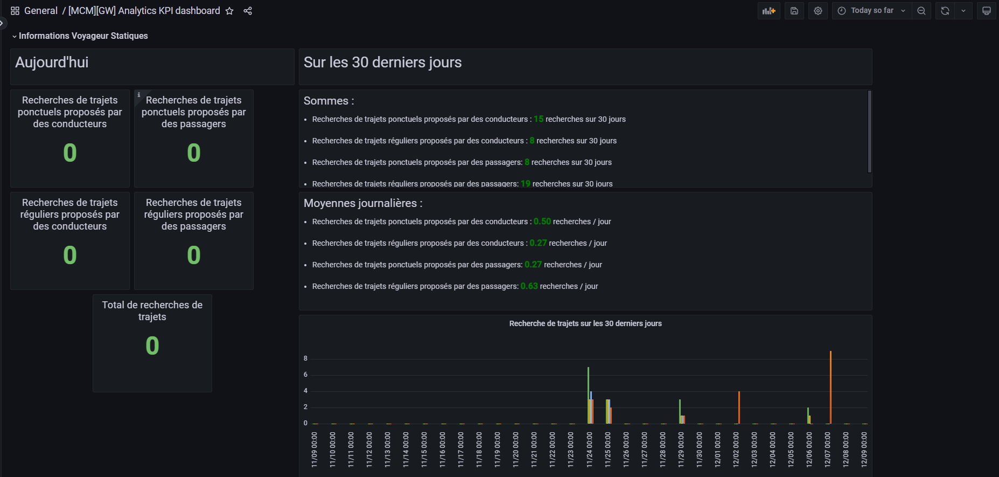
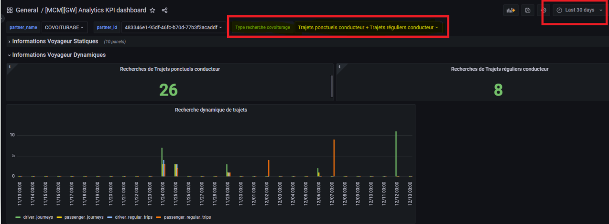
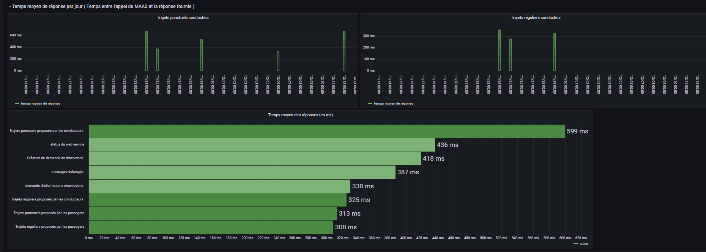
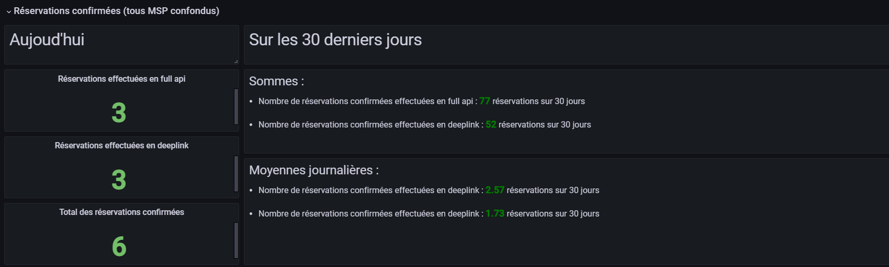
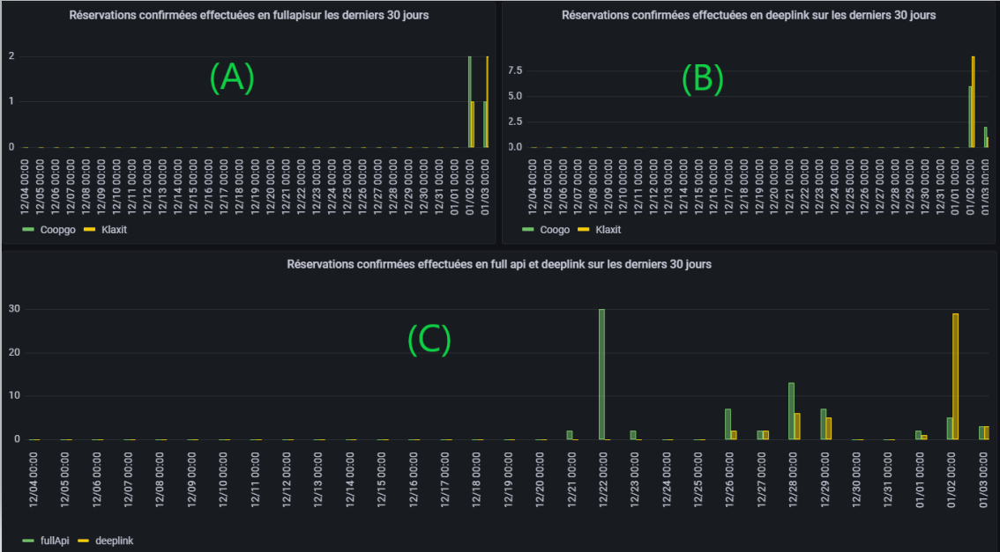

## Description

Afin de surveiller les performances de la gateway et surveiller son usage, un board grafana a été créé pour pouvoir
remonter les différentes statistiques de l'utilisation de la gateway. Ce board a été exporté et mis dans le dossier kpi.

Pour visualiser les graphes sur Grafana, nous allons exploiter les données collectées par Elasticsearch. Elasticsearch
permet de stocker et indexer les données intéressantes à partir de Gravitee (requêtes, logs, response body...). En
fonction du kpi étudié, nous allons requêter et exploiter ces données pour construire des visualisations graphiques sur
Grafana.

Afin de réquêter les données d'élasticsearch nous avons utilisé un plugin Json
API https://grafana.github.io/grafana-json-datasource/ paramétré avec les informations d'elasticsearch afin de le
requête en REST.

Le premier board remonte des statistiques concernant le nombre de recherches de trajets (kpi 1) et le temps moyen de
réponse pour chaque type de trajet (kpi 2). Pour chaque kpi, nous avons des résultats statiques et dynamiques.

#### KPI 1 : nombre de recherches de trajets

Le Kpi 1 remonte quatres types d'informations :

- Nombre de recherches de trajets ponctuels proposés par des conducteurs : il représente le nombre de fois où l'endpoint
  Driver_journeys a été exécuté avec succès
- Nombre de recherches de trajets ponctuels proposés par des passagers : il représente le nombre de fois où l'endpoint
  Passenger_journeys a été exécuté avec succès
- Nombre de recherches de trajets réguliers proposés par des conducteurs : il représente le nombre de fois où l'endpoint
  Driver_regular_trips a été exécuté avec succès
- Nombre de recherches de trajets réguliers proposés par des passagers : il représente le nombre de fois où l'endpoint
  Passenger_regular_trips a été exécuté avec succès

Pour la partie statique (capture 1 ci-dessus), nous remontons des statistiques sur les recherches de trajets d'aujourd'
hui (partie gauche) et durant les derniers 30 jours (partie droite) ainsi que la moyenne sur 30 jours.

Et pour la partie dynamique (capture 2 ci-dessus), nous remontons les mêmes informations, cette fois-ci, filtrées en
fonction du temps et de type de trajet.

#### KPI 2 : Temps moyen de réponse de la gateway

Pour le KPI 2, nous remontons le temps moyen de réponse par jour et par mois. Il est décliné par partnerId et par type
de trajets selon les filtres utilisés. Les résultats remontés pour ce kpi concernent uniquement les recherches succès (
capture ci-dessous).

#### KPI 3 : Nombre de réservations en full api et en deeplink

Le deuxième board _**[MCM] [GW] KPI Reservation**_ remonte des analytics concernant le nombre de réservations effectuées
en full api et en deeplink (kpi 3). Pour ce kpi, nous avons des résultats statiques et dynamiques.

Pour le KPI 3, nous remontons les statistiques concernant les réservations confirmées et soumises en full api et en
deeplink. Ces statistiques sont divisées en deux parties : statiques et dynamiques.

Pour les résultats statiques, nous avons le nombre de réservations confirmées et soumises en full api et en deeplink
d'aujourd'hui (partie gauche) et durant les derniers 30 jours (partie droite) ainsi que la moyenne des réservations sur
30 jours (capture ci-dessous).

Nous remontons également deux visualisations graphiques représentant le nombres de réservations par jour pour chaque MSP
durant les derniers 30 jours (capture ci-dessous) :

- le graphe (A) représente le nombre de réservations confirmées effectuées en **full api** par jour pour chaque
  partenaire (
  les partenaires sont représentées en barres).
- le graphe (B) représente le nombre de réservations confirmées effectuées en **deeplink** par jour pour chaque
  partenaire.
- le graphe (C) représente le nombre de réservations confirmées effectuées en full api et en deeplink par jour pour un
  partenaire donné (Type de réservation en barres).

NB: Dans le cas d'un paramétrage de nouveaux partenaires en base de données, il faut mettre à jour les graphes (A)
et (B) sur Grafana, en ajoutant les nouveaux identifiants partenaires dans les rubriques fields sur grafana, pour
permettre l'agrégation des nouveaux partnerId et l'affichage des barres représentant ces derniers. (pour faire cette
opération, il faut faire un Edit sur le graphique, ensuite, dans la rubrique field, ajouter un nouveau field avec le
script :
_$.aggregations.group-by-uri.buckets[?(@.key == "partnerId")].histo-by-msp-bucket.buckets[*].doc_count_).

Et pour la partie dynamique, nous remontons ces mêmes visualisations avec la possibilité de filtrer sur le temps, le
partnerId ou bien le type de réservation.

