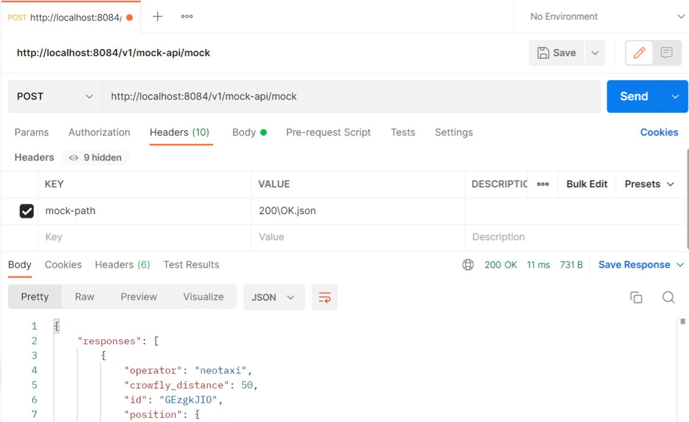

## Service de mocks

Afin de pouvoir simuler les différentes réponses des partenaires extérieurs, le microservice de mocks `mock-api` permet de répondre avec un code retour et un body (facultatif) au choix. \
Il s'agit d'un module additionnel, indépendant de tous les autres.

### Configuration en local
Ajouter à votre settings.xml l'entrée permettant de choisir le répertoire contenant les réponses mockées (au sein des properties du profile dev), par exemple:
```xml
<gateway.service.mockapi.dir>C:\Temp\maasmocks</gateway.service.mockapi.dir>
```
Lancer MockApiApplication et appeler http://localhost:8084/v1/mock-api/mock


### Fonctionnement
Le service de mock :
- répond sur le chemin /v1/mock-api/mock
- répond à tous les verbes HTTP à l'exception de TRACE (déconseillé par un audit de sécurité)
- log les paramètres, headers et body de la requête reçue
- log le code retour et le body de la réponse
- utilise le header spécifique `mock-path` pour sélectionner la réponse

**Traitement du header mock-path** :
Il peut être de la forme dir1\...\dirx\CODE_RETOUR\BODY.json
- dir1\\...\dirx\ est une arborescence facultative de dossiers permettant d'organiser les réponses en scénarios et cas d'usage
- le dernier dossier CODE_RETOUR est obligatoire et doit être un entier correspondant à un code HTTP existant
- le dernier élement est facultatif et correspond au fichier contenant le body désiré dans la réponse

Exemples avec dans le dossier de mocks un répertoire 999 vide, répertoire 200 contenant un fichier OK.json, un répertoire TEST contenant un sous-répertoire 201 vide :
- mock-path=200\OK.json renvoie un code HTTP 200 et le contenu d'OK.json dans le body
- mock-path=TEST\201\ renvoie un code HTTP 201 sans body
- mock-path=200\file.json renvoie une erreur 404 car le fichier n'est pas trouvé
- mock-path=999\ renvoie une erreur 500 car le code retour 999 n'est pas valide


  

### Visualisation des logs
Dans la console du microservice mock-api, visualisez les logs :

Exemple de log d'une requête reçue :
```
Requested POST with mock-path 200\OK.json | request parameters a=[b1, b2], c=[d] | headers host=[localhost:8084], user-agent=[insomnia/2022.5.1], mock-path=[200\OK.json], content-type=[application/xml], accept=[*/*], content-length=[23] | body : {	"request": "value"}
```
Exemple de log d'une réponse renvoyée :
```
Responding to the POST with mock-path 200\OK.json | response code 200 | body : {	"key1": "value1",		"key2": "value2"}
```

