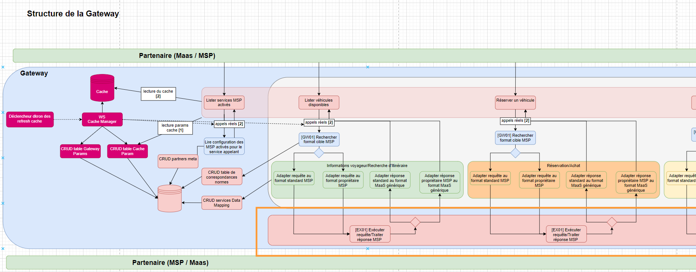
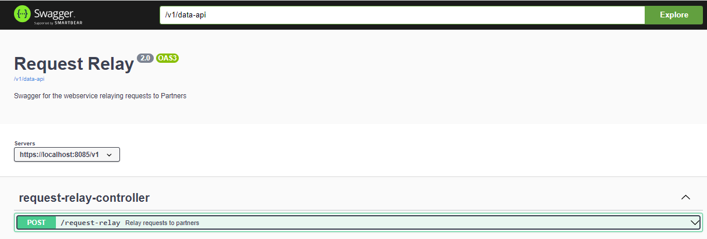

# Documentation technique du module Request-Relay

## Description
 
Le module request-relay (encadré orange ci-dessus) exécute les requêtes auprès des partenaires interrogés. Il est le seul microservice qui réalise des appels vers l'extérieur de la Gateway. \
Le microservice expose un unique endpoint :

 - Le POST /request-relay prend en entrée un objet PartnerCallsFinalDTO contenant les informations nécessaires pour exécuter l'appel au partenaire (url avac paramètres, method http, body, headers). Un paramètre "protocol" permet également de spécifier si le partenaire à appeler suit un protocole REST ou SOAP (seul le REST est actuellement implémenté). \
   Il renvoie la réponse de l'appel.

## Relations avec les autres modules

Comme représenté sur le schéma "Structure de la Gateway" plus haut, l'endpoint /request-relay du microservice est interrogé par l'adaptateur qui lui fournit l'objet PartnerCallsFinalDTO correspondant à la requête initiale (l'adaptateur a construit le PartnerCallsFinalDTO lors de l'adaptation de la requête). \
La requête définie par cet objet est exécutée et sa réponse retournée sans transformation.

#### Bilan des relations :
- Dépendance avec "common-api" : le module common-api fournit des dictionnaires de constantes et divers classes utilitaires

## Swagger et port

Le swagger fournit une documentation détaillée des différents endpoints et modèles du module.
Au lancement du microservice, le swagger de la class RequestRelayController est généré sur le port 8085. \
Url du swagger : http://localhost:8085/v1/swagger-ui/index.html