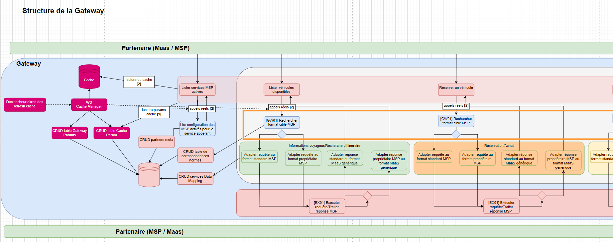
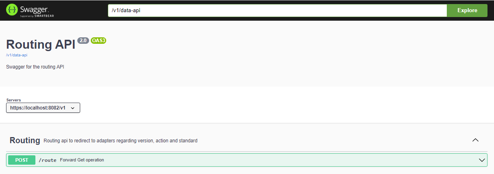

# Documentation technique du module Routing

## Description
 
Le module routing (encadré orange ci-dessus) est un microservice d'aiguillage des requêtes des partenaires. \
Le module api transmet au routing les paramètres de la requête afin qu'il la redirige vers l'adaptateur approprié pour la coversion de la requête au format (standard ou propriétaire) du partenaire appelé. \
Le microservice Routing expose un unique endpoint POST /route :

- Le endpoint prend en entrée le partnerId et l'actionName (ex : STATION_SEARCH, ASSETS_SEARCH ...) et retourne la réponse du partenaire pour cette action, transformée au format exposé par la Gateway dans Api.

## Relations avec les autres modules

Comme représenté sur le schéma "Structure de la Gateway" plus haut, l'api effectue une requête auprès du routing en lui passant le partnerId X et actionName Y du endpoint appelé. \
Le routing effectue une requête GET vers data-api sur la table partner_standard en filtrant sur les paramètres passés. \
Le PartnerStandard récupéré fourni la "norme", "version_norme", "version_dataMapping" et adapter_id  suivis par le partenaire X pour traiter l'action Y. Le module adapters possède plusieurs adapter, l'adapterId indique celui à utiliser. \
Le module routing en déduit à quel adaptateur il doit envoyer la requête pour faire la transformation avec les bonnes versions et construit l'url associé.
Routing réalise un appel http vers l'adaptateur déterminé pour lui transmettre la requête initiale.

#### Bilan des relations :
- Dépendance avec "common-api" : le module common-api fournit des dictionnaires de constantes et divers classes utilitaires
- Requêtes HTTP vers le microservice "data-api" : récupération du PartnerStandard associé à le requête reçue de api
- Requêtes HTTP vers le microservice "default-adapter" (ou autre adaptateur) du module "adapters" : routing redirige la requête vers l'adaptateur adéquat

## Swagger et port

Le swagger fournit une documentation détaillée des différents endpoints et modèles du module.
Au lancement du microservice, le swagger de la class RoutingApiController est généré sur le port 8082. \
Url du swagger : http://localhost:8082/v1/swagger-ui/index.html